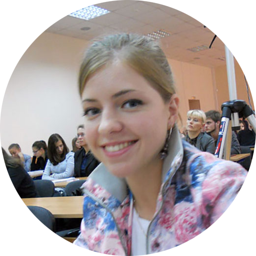

# Lida Kifak

### Junior Frontend Developer

---

### Contact information

**Phone:** +7 985 089 46 41  
**E-mail:** manatkina.ls@gmail.com  
**Telegram:** [@lida_one](https://t.me/lida_one)  
**GitHub:** [LidaMan](https://github.com/LidaMan)  
**Discord:** Lida Man (@LidaMan)

---

### About Me

I am a Junior Frontend Developer with experience in programming reports using R language and developing web pages using HTML and CSS. My goal is to continuously improve and enhance my skills in frontend development. I am a persistent and ambitious professional, ready to take on any challenges and strive for high achievements.

---

### Skills

**Web development skills:**

- HTML (advanced)
- CSS, CSS Grid, CSS Flex (proficient)

**Programming skills:**

- R (basic)
- JavaScript (basic)

**Work tools:**

- Git / GitHub
- Jira
- Notion

**Coding tools:**

- Visual Studio Code
- RStudio
- Goland

**Graphic tools:**

- Adobe Photoshop (advanced)
- CorelDRAW (advanced)

**Statistical analysis:**

- IBM SPSS

---

### Code Example

```{r motivator}
motivator <- function(params) {
  sorted_scores <- sort(unlist(r_params$scores[scales_main]), decreasing = TRUE)
  top_scales <- names(sorted_scores[sorted_scores > 70])
  if (length(top_scales) > 3) {
    top_scales <- top_scales[1:3]
     if (any(duplicated(sorted_scores[1:4]))) {
      max_scores <- sorted_scores[1:4]
      top_scales <- names(max_scores)
     }
   }
  if (length(top_scales) == 0 || all(sorted_scores <= 70)) {
    med_score <- max(unlist(r_params$scores[scales_main]))
    top_scales <- names(params$scores)[which(params$scores == med_score)]
  }
  top_scales_text <- lapply(top_scales, function(scale) {
    if (length(top_scales) == 0 || all(sorted_scores <= 70)) {
    paste0("<div class='motivator_scale_title'>", params$texts[[scale]]$scale_title, " </div>",
           "<div class='motivator_scale_description'>", params$texts[[scale]]$scale_description_med, "</div>")
    } else {
      paste0("<div class='motivator_scale_title'>", params$texts[[scale]]$scale_title, " </div>",
           "<div class='motivator_scale_description'>", params$texts[[scale]]$scale_description_high, "</div>")
    }
  })
  htmltools::HTML(paste("<div>", paste(top_scales_text, collapse = "</div><div>"), "</div>"))
}
motivator(r_params)
```

---

### Professional Experience

| Year           | Employment                     |                                            Position                                            |
| -------------- | ------------------------------ | :--------------------------------------------------------------------------------------------: |
| 2021 — Present | ECOPSY Company, Moscow, Russia | - Junior R Lang Developer, analyst (2022 — Present)<br>- R&D specialist, analyst (2021 — 2022) |

---

### Education

| Year                 |                                                  Education                                                   |
| -------------------- | :----------------------------------------------------------------------------------------------------------: |
| **Higher Education** |                                                                                                              |
| 2022                 |   National Research University "Higher School of Economics", Moscow, Social Sciences, Positive Psychology    |
| 2014                 |                      Moscow State University, Moscow, Psychology, Psychologist-Educator                      |
| **Courses**          |                                                                                                              |
| In process           |                                   RS School, JavaScript/Front-end. Stage0                                    |
| 2020                 |                                  Smirnov School, Fundamentals of CG Drawing                                  |
| 2014                 | Computer Training Center "Specialist" at Bauman Moscow State Technical University, Graphic Design Specialist |

---

### Languages

- Russian — Native
- English — B1 — Intermediate
